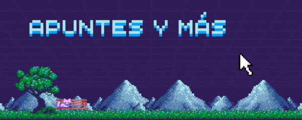

<h1 align="center"><b>Hi , I'm Víctor </b></h1>
<!--  -->

  

<!--  -->
<table align="center">
  <tr>
    <th>Milestone 0</th>
    <th>Milestone 1</th>
    <th>Milestone 2</th>
    <th>Milestone 3</th>
    <th>Milestone 4</th>
    <th>Milestone 5</th>
    <th>Milestone 6</th>
  </tr>
<!-- Start Row 1 -->
  <tr>
    <td align="left">
      <ul>
        <b><a href="https://github.com/victor-goyzueta/libft">libft</a> </b>
      </ul>
    </td>
    <td align="left">
      <ul>
        <b><a href="https://github.com/victor-goyzueta/ft_printf">ft_printf</a> </b>
      </ul>
    </td>
    <td align="left">
      <ul>
        <b><a href="https://github.com/victor-goyzueta/minitalk">minitalk</a> </b>
      </ul>
    </td>
    <td align="left">
      <ul>
        <b><a>-----</a> </b>
      </ul>
    </td>
    <td align="left">
      <ul>
        <b><a>-----</a> </b>
      </ul>
    </td>
    <td align="left">
      <ul>
        <b><a>-----</a> </b>
      </ul>
    </td>
    <td align="left">
      <ul>
        <b><a>-----</a> </b>
      </ul>
    </td>
  </tr>
<!-- Start Row 2 -->
  <tr align="center">
    <td align="left">
      <ul>
        <b><a>-----</a> </b>
      </ul>
    </td>
    <td align="left">
      <ul>
        <b><a href="https://github.com/victor-goyzueta/get_next_line">get_next_line</a> </b>
      </ul>
    </td>
    <td align="left">
      <ul>
        <b><a href="https://github.com/victor-goyzueta/push_swap">push_swap</a> </b>
      </ul>
    </td>
    <td align="left">
      <ul>
        <b><a>-----</a> </b>
      </ul>
    </td>
    <td align="left">
      <ul>
        <b><a>-----</a> </b>
      </ul>
    </td>
    <td align="left">
      <ul>
        <b><a>-----</a> </b>
      </ul>
    </td>
    <td align="left">
      <ul>
        <b><a>-----</a> </b>
      </ul>
    </td>
  </tr>
<!-- Start of row 3 -->
  <tr align="left">
    <td align="left">
      <ul>
        <b><a>-----</a> </b>
      </ul>
    </td>
    <td align="left">
      <ul>
        <b><a href="https://github.com/victor-goyzueta/Born2beroot">Born2beroot</a> </b>
      </ul>
    </td>
    <td align="left">
      <ul>
        <b><a href="https://github.com/victor-goyzueta/so_long">so_long</a> </b>
      </ul>
    </td>
    <td align="left">
      <ul>
        <b><a>-----</a> </b>
      </ul>
    </td>
    <td align="left">
      <ul>
        <b><a>-----</a> </b>
      </ul>
    </td>
    <td align="left">
      <ul>
        <b><a>-----</a> </b>
      </ul>
    </td>
    <td align="left">
      <ul>
        <b><a>-----</a> </b>
      </ul>
    </td>
  </tr>
</table>

 

<!--  -->

  
  

 

<!--  -->

  

 

<!--  -->

  

 

<!--  -->

 
